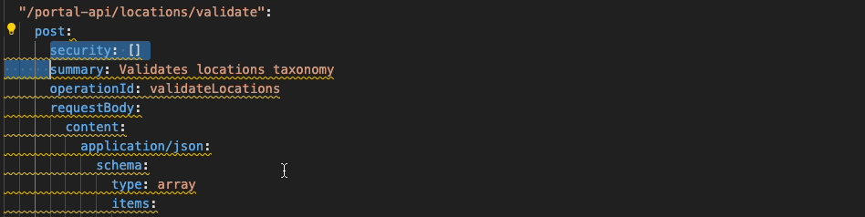

 

# Spectral quick fix for Visual Studio Code

> [Summary](#summary) · [Getting Started](#getting-started) · [Contributing](#contributing) · [Support](#support)

## Summary

This extension, within the API Scoring product, is meant to help developers to achieve the best API Certification grade in their APIs. Since the certification service retrieves principles, the book of best practices in the API ecosystem, the accomplishment of these rules is crucial to obtain the A+.

Since this extension is based on [Spectral](https://github.com/stoplightio/spectral), it uses its engine to lint possible errors/warnings retrieved from the API White Paper principles. Once linted, with just a click you could add/remove code in your API.

### Related products

For being part of the API Scoring product, it is related to the [API Scoring](/plugins/vscode-apiscoring/README.md).

### Technology

 - Language: TypeScript and JavaScript.
 - Type of artifact: Visual Studio Code extension.

## Getting started

To learn which are the **prerequisites** to this extension and **how to install** it, this document will show you how. 

## Contributing

Check our `CONTRIBUTING.md` file for details about the product/artifact structure, code formatting, naming conventions, and the process for submitting pull requests with contributions.

## Support

If you have questions regarding the performance of any functionality in this tool, please open an issue in the Issues tab of the GitHub repository.
